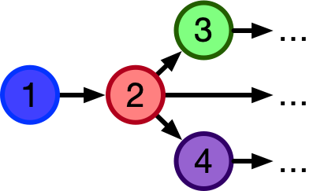

#  CombinatorialEnumeration.jl

## Motivation
Suppose you are given a formally specified theory, for example the theory of (small) [categories](https://www.math3ma.com/blog/what-is-a-category), which says that a *category* `C` is specified by:
- A set of *objects*, `Ob(C)`
- For each pair of objects `a,b ∈ Ob(C)`, a set of arrows `Hom(a,b)`.
- A composition operator that gives an arrow in `f⋅g ∈ Hom(a,c)` for each pair of arrows `f ∈ Hom(a,b)` and `g ∈ Hom(b,c)`.
- An identity arrow `id(a) ∈ Hom(a,a)` for each object `a ∈ Ob(C)`
- Furthermore, this data must satisfy some constraints:
  - Unitality: `id(a)⋅f = f = f⋅id(b)` for each `f ∈ Hom(a,b)`
  - Associativity: `(f⋅g)⋅h = f⋅(g⋅h)` for each triple of composable arrows.

Even if each individual piece of data or constraint in this definition is straightforward, definitions might seem overwhelming at first insofar as we come across the following types of problems:
  - What are the 5 simplest categories?
  - Given this proposed category, is it actually a category?
  - Are there any categories (bounded by some max size) such that some property `ϕ` holds?

There is pedagogical value in working through these types of problems in one's head, but there is also value in having these answers automatically ready at hand when trying to think about / build intuition for more complicated concepts. There is something mechanical about this process, and the purpose of this repo is to mechanize precisely that in an efficient way that's also usable for people trying to build their intuitions.

## Notes on categories of sketch models
From "Toposes, Triples and Theories" (Barr and Wells)

- Theorem 4.3: Every FP-theory has an extension to an LE-theory which has the
same models in any LE-category.
- Theorem 4.4 : The
category of set-valued models of a left exact theory has arbitrary limits and
all filtered colimits; moreover, these are preserved by the set-valued functors
of evaluation at the objects of the theory.
- Theorem 4.1: (outlines which kinds of sketches have which kinds of (co)limits)
