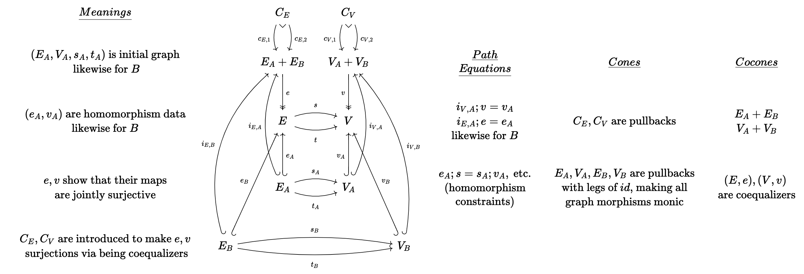
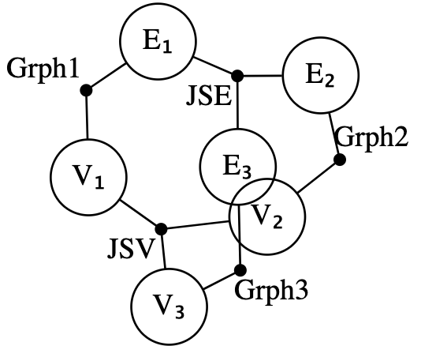
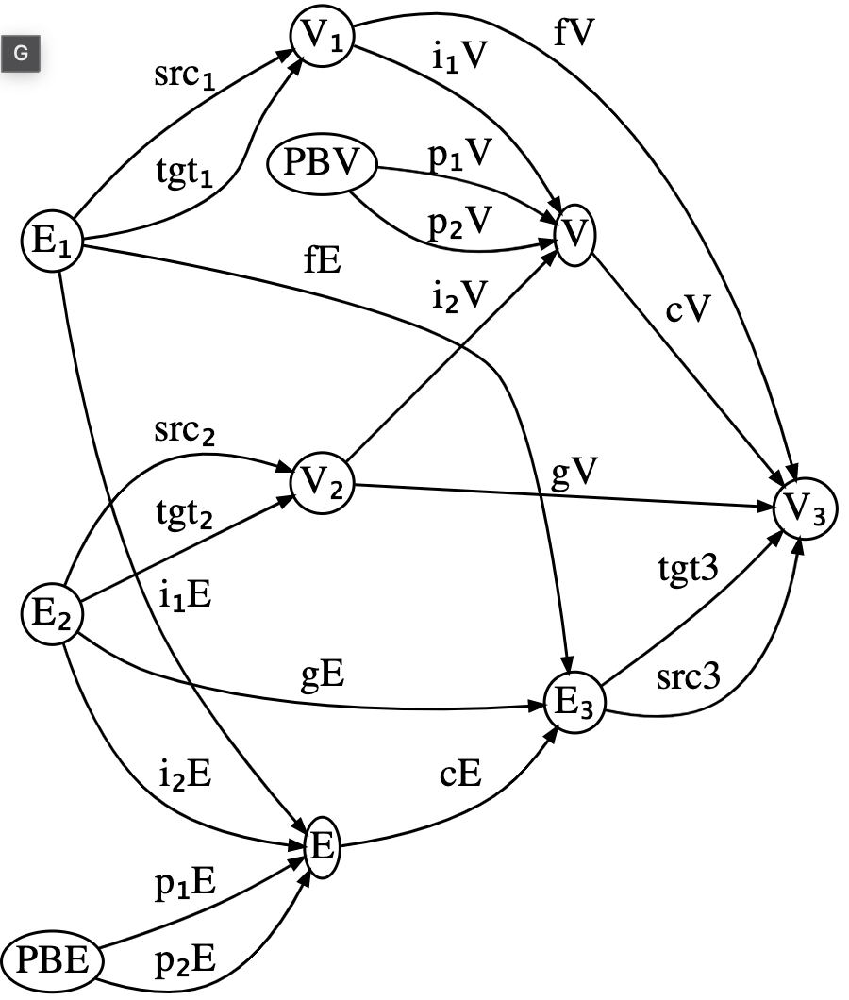

# CombinatorialEnumeration.jl


## Motivating example
Suppose you are given a formally specified theory, for example the theory of
(small) [categories](https://www.math3ma.com/blog/what-is-a-category), which
says that a *category* `C` is specified by:
- A set of *objects*, `Ob(C)`
- For each pair of objects `a,b ∈ Ob(C)`, a set of arrows `Hom(a,b)`.
- A composition operator that gives an arrow in `f⋅g ∈ Hom(a,c)` for each
  pair of arrows `f ∈ Hom(a,b)` and `g ∈ Hom(b,c)`.
- An identity arrow `id(a) ∈ Hom(a,a)` for each object `a ∈ Ob(C)`
- Furthermore, this data must satisfy some constraints:
  - Unitality: `id(a)⋅f = f = f⋅id(b)` for each `f ∈ Hom(a,b)`
  - Associativity: `(f⋅g)⋅h = f⋅(g⋅h)` for each triple of composable arrows.

Even if each individual piece of data or constraint in this definition is
straightforward, definitions might seem overwhelming at first insofar as we come
across the following types of problems:
  - What are the 5 simplest categories?
  - Given this proposed category, is it actually a category?
  - Are there any categories (bounded by some max size) such that some
    property `ϕ` holds?

There is pedagogical value in working through these types of problems in one's
head, but there is also value in having these answers automatically ready at
hand when trying to think about / build intuition for more complicated concepts.
There is something mechanical about this process, and the purpose of this repo
is to mechanize precisely that in an efficient way that's also usable for people
trying to build their intuitions.

## Motivation

There are lots of constraint solvers which can find models. For example, SMT can
generate a model `M` (or tell you one doesn't exist), and then you can add
another axiom to rule out `M` and try again until you've enumerated all models.
While SMT's first-order logic is an appealing modeling language due to its
flexibility (usually, one can encode easily one's domain in this universal
language), it's a bit awkward to detail with certain types of data. In
particular, combinatorial data (here, meaning collections of finite sets with
finite maps between them that satisfy certain properties, e.g. bipartite
graphs).

This repo explores another corner of the design space, motivated by the idea of
sketches from category theory. These have been argued to be a good [framework
for knowledge management](https://www.nasa.gov/sites/default/files/ivv_wojtowicz_sketch_theory_as_a_framework_for_knowledge_management_090214.pdf)
because the category theory behind sketches allows to automatically reason about
the relationships between different pieces of knowledge without requiring
reasoning about arbitrary first-order logic, which is notoriously difficult.

Sketch-constraint solving is like a subset of general constraint programming
because there are only a few special types of constraints that need be enforced.
The downside is that may have to think how to represent their domain as a
sketch, rather than using arbitrary first-order logic or code. There are at
least a few upsides:
- the solver has potential to be very efficient for the few types of constraints
  sketches require reasoning about combinatorial data, rather than logical formulas, allows us to
  work [up to isomorphism](https://github.com/AlgebraicJulia/CSetAutomorphisms.jl)
  incrementally throughout the entire model exploration process, rather than
  quotienting our results at the end.
- Sketches can be constructed compositionally, and, moreover, there are clean
  relationships between `Mod(A+B)` (i.e. the models of some sketch that is
  related in some way to `A` and `B`) to `Mod(A)`  and `Mod(B)`.


## Models
For our purposes, a *model* is an instance of a relational database, i.e. a
collection of tables with foreign keys between them. Normally, one can stick
whatever data one wants into the tables of a database. Suppose our schema is
E⇉V. If we enumerate models on this schema, we will obtain all directed
multi-graphs. Here are the first few:

[todo]

However, we might wish to enumerate the smallest groups:

[todo]

There is no correspondence between groups and databases. At best, every group
can be represented by a certain database instance, but only a very select few
database instances on that schema are actually groups. If we tried to enumerate
the databases that might be groups of order 10 and then filter those which are
actually groups, we would have to enumerate 10^... This isn't feasible, so we
need to incorporate our constraints into the search process. The language of
finite limit sketches allows us to say how we wish to restrict which databases
are valid models.

## Finite (co)limit sketches

A sketch contains a schema, just like a relational database. However, it
contains three kinds of extra data which constrain models.

### Path Equations
We can assert that sequences of foreign keys in a database must yield the same
result. An example of this is the case of reflexive graphs.

We add to our schema a designated `refl` edge for each vertex. The equalities:
- `refl; src = idᵥ`
- `refl; tgt = idᵥ`

Capture the fact that a database with a vertex whose reflexive edge starts or
ends at a different vertex is *not* a valid model.

### Cone objects

A sketch can designated a particular object to satisfy the *cone* constraint.
This constraint says that the elements of that table are in bijection with
matches of some pattern found elsewhere in the database. A pullback is the
classic example of this: we want to identify pairs that agree on a certain
value. For example, a database might have:

[CTS type example]

To enforce that the _ table actually contains the intended content, we assert it
is in bijection with the following pattern.

[todo]

There are many more examples that can show off the versatility of cone
constraints.

### Cocone objects

The last type of constraint available is that of cocones. A cocone object is
asserted to be in bijection with certain equivalence classes (i.e. partitions,
quotients) of the objects in a diagram. A pushout is the classic example of
this: we wish to glue together two tables in our database along a common
boundary.

[example]


## Compositionality

This peculiar language of constraints has an advantage that comes from the fact
that sketches can be related to each other (there is a *category* of sketches).
This means that, for example, gluing sketches together can be a meaningful
operation - if we have computed the models for the individual components, then
a very efficient operation can construct the composite models, rather than
starting from scratch. Below we work through an extended example involving a
sketch whose models are ways two graphs can overlap.

### Construction of sketches via colimits

The following sketch is quite large, although it can be described simply as
depicting pair of monic graph morphisms that are jointly surjective onto a third
graph.



If we manually create this from scratch, the code might look like below (full
source code [here](https://github.com/kris-brown/CombinatorialEnumeration.jl/blob/main/src/examples/GraphOverlap.jl)).

We first write out the schema:

```julia
schema = @acset LG begin
  V=10; E=20; vlabel=[:V₁,:V₂,:V₃,:V₁_V₂,:PBᵥ,:E₁,:E₂,:E₃,:E₁_E₂,:PBₑ];
  elabel=[:fᵥ,:gᵥ,:iᵥ₁,:iᵥ₂,:pᵥ₁,:pᵥ₂,:fᵥ_gᵥ,
          :fₑ,:gₑ,:iₑ₁,:iₑ₂,:pₑ₁,:pₑ₂,:fₑ_gₑ,
          :s₁,:t₁,:s₂,:t₂,:s₃,:t₃];
  src=[1,2,1,2,5,5,4, 6,7,6,7,10,10,9, 6,6,7,7,8,8];
  tgt=[3,3,4,4,4,4,3, 8,8,9,9,9, 9, 8, 1,1,2,2,3,3]
end
```

We then define all of the cones/cocones, which is done with many many lines of
tedious boilerplate. There is also the specification of path equalities which
we omit here.

The above approach could be simplified if one has already implemented a [sketch
for jointly surjective functions](https://github.com/kris-brown/CombinatorialEnumeration.jl/blob/main/src/examples/JointSurj.jl). Combined with
a sketch for graphs (which can be produced via `Grph = Sketch(SchGraph)` as the
schema for graphs is already provided by Catlab), we can express our sketch as
the gluing together of five sketches: two copies of `JointSurj` and three copies
of `Grph`. We start this by declaring a composition pattern, given by an
undirected wiring diagram which can be generated via the `@relation` macro.

```julia
r = @relation () begin
  V₁(JSV, Grph1); V₂(JSV, Grph2); V₃(JSV, Grph3)
  E₁(JSE, Grph1); E₂(JSE, Grph2); E₃(JSE, Grph3)
end;
```



We can see that `Grph1` relates `E1` and `V1`, while a `JointSurj` (interpreted
as applicable to sets of edges) named `JSE` connects all three edge sets. We
compute our composite sketch by assigning a sketch to each black junction and
assigning data which indicates overlaps between the sketches in the open circles.

```julia
res = overlap(r,
  # fill junctions with sketches
  (Grph1 = Grph, Grph2 = Grph, Grph3 = Grph, JSV = JointSurj, JSE = JointSurj),
  # fill circles with overlap criteria
  (V₁=[(:V₁=>(Grph1=:V, JSV=:A))],
   V₂=[(:V₂=>(Grph2=:V, JSV=:B))],
   V₃=[(:V₃=>(Grph3=:V, JSV=:C))],
   E₁=[(:E₁=>(Grph1=:E, JSE=:A))],
   E₂=[(:E₂=>(Grph2=:E, JSE=:B))],
   E₃=[(:E₃=>(Grph3=:E, JSE=:C))])) |> apex;
```

Some of the autogenerated names may be verbose, so we can apply regexes to trim
those down.

```julia
res2 = rename(res, Dict(
  r"_Grph"=>"", r"_Grph"=>"", r"_Coprod"=>"","1"=>"₁","2"=>"₂","iA"=>"i₁",
  "iB"=>"i₂","_JS"=>"")) |> codom
```



Almost all of the data of the sketch is there - all that is missing are the
subset of equations that involve communication between the different building
blocks we glued together. These can be added afterwards.

If we happen to not have jointly surjective maps defined for us already, we can
construct the sketch using the simpler building blocks of graphs, monos, epis,
and coproducts. This requires a more involved assembly process, however.

```julia

r = @relation () begin
  V₁(Grph1, MonoV1, CoprodV)
  V₂(Grph2, MonoV2, CoprodV)
  E₁(Grph1, MonoE1, CoprodE)
  E₂(Grph2, MonoE2, CoprodE)
  V₁V₂(CoprodV, SurjV)
  E₁E₂(CoprodE, SurjE)
  V₃(MonoV1, MonoV2, SurjV, Grph3)
  E₃(MonoE1, MonoE2, SurjE, Grph3)
end;

res = overlap(r,
  # fill junctions with sketches
  (Grph1 = Grph, Grph2 = Grph, Grph3 = Grph,
   CoprodV = Coprod, CoprodE = Coprod,
   SurjV = Surj, SurjE = Surj,
   MonoV1 = Inj, MonoV2 = Inj, MonoE1 = Inj, MonoE2 = Inj),
  # fill circles with overlap criteria
  (V₁=[(:V₁=>(Grph1=:V,MonoV1=:A, CoprodV=:A))],
   V₂=[(:V₂=>(Grph2=:V,MonoV2=:A, CoprodV=:B))],
   E₁=[(:E₁=>(Grph1=:E, MonoE1=:A, CoprodE=:A))],
   E₂=[(:E₂=>(Grph2=:E, MonoE2=:A, CoprodE=:B))],
   V₁V₂=[(:V₁V₂=>(CoprodV=:A_B, SurjV=:A))],
   E₁E₂=[(:E₁E₂=>(CoprodE=:A_B, SurjE=:A))],
   V₃=[(:V₃=>(MonoV1=:B, MonoV2=:B, SurjV=:B, Grph3=:V))],
   E₃=[(:E₃=>(MonoE1=:B, MonoE2=:B, SurjE=:B, Grph3=:E))])) |> apex;
```

As a final throught here, the entire sketch might be conceived as a *product*
of `Grph` and `JointSurj`. Implementing limits of sketches is much more
challenging than colimits, so this feature may take a while before it is ready.

## Aside: Notes on categories of sketch models
Just for reference, from "Toposes, Triples and Theories" (Barr and Wells)

- Theorem 4.3: Every FP-theory has an extension to an LE-theory which has the
  same models in any LE-category.
- Theorem 4.4 : The category of set-valued models of a left exact theory has
   arbitrary limits and all filtered colimits; moreover, these are preserved by
   the set-valued functors of evaluation at the objects of the theory.
- Theorem 4.1: (outlines which kinds of sketches have which kinds of (co)limits)